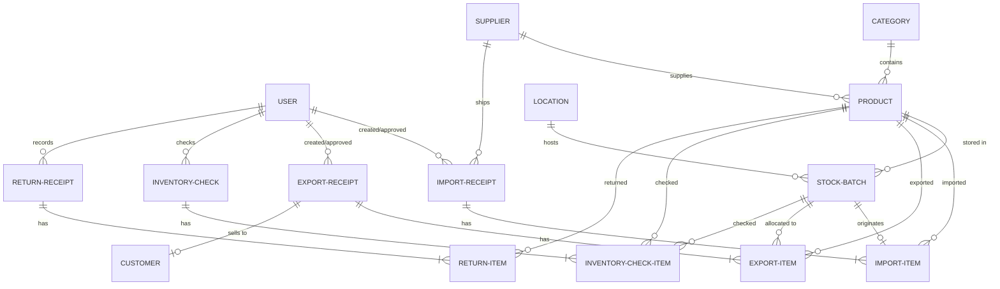

# Phân tích Chi tiết Dự án StockInsight Backend

Dưới đây là tài liệu phân tích chi tiết về kiến trúc, công nghệ, thiết kế cơ sở dữ liệu, các thuật toán cốt lõi và luồng xử lý nghiệp vụ của dự án StockInsight Backend.

---

## 1. Tổng quan Dự án (Project Overview)
* **Tên dự án:** StockInsight Backend
* **Mục tiêu:** Cung cấp hệ thống API RESTful bảo mật và ổn định cho hệ thống Quản lý kho hàng (StockInsight Frontend).
* **Trọng tâm Nghiệp vụ:** Quản lý xuất nhập tồn kho hàng hóa với việc áp dụng nghiêm ngặt thuật toán **FEFO (First Expired First Out - Hết hạn trước xuất trước)** nhằm giảm thiểu hư hỏng và tối ưu hóa việc sử dụng các sản phẩm có thời hạn sử dụng.

---

## 2. Công nghệ Sử dụng (Tech Stack)
* **Runtime Môi trường:** Node.js (v22+)
* **Framework Web:** Express.js (`express` v5.2.1)
* **ORM:** Prisma ORM (`@prisma/client` & `prisma` v7.8.0)
* **Cơ sở Dữ liệu:** PostgreSQL
* **Bảo mật & Mã hóa:** 
  * `jsonwebtoken` (JWT) cho xác thực không trạng thái (stateless authentication).
  * `bcryptjs` mã hóa mật khẩu một chiều (hashing).
  * `helmet` bảo vệ các HTTP headers chống lại các lỗ hổng web phổ biến.
  * `cors` kiểm soát tài nguyên chéo nguồn.
* **Logging & Giám sát:** `morgan` (HTTP request logging) và `winston` (hoặc console log tùy chỉnh).
* **Tài liệu API:** `swagger-jsdoc` & `swagger-ui-express` tự động tạo giao diện thử nghiệm API tương tác trực quan tại `/api-docs`.
* **Testing Stack:** `jest` và `supertest` phục vụ kiểm thử đơn vị (Unit Test) và kiểm thử tích hợp (Integration Test).

---

## 3. Cấu trúc Cơ sở dữ liệu (Prisma Schema - 14 Models)
Cơ sở dữ liệu của StockInsight được thiết kế chuẩn hóa cao, hỗ trợ việc quản lý chi tiết từ thông tin sản phẩm, vị trí lưu kho cho tới kiểm kê và ghi nhận dấu vết hoạt động.



### Các Thực thể Chính (Core Entities)
1. **`User` (Người dùng):**
   * Quản lý thông tin định danh (`email`, `password`, `name`).
   * Phân quyền thông qua thuộc tính `role` với kiểu dữ liệu Enum: `ADMIN` (Quản trị viên), `WAREHOUSE_MANAGER` (Thủ kho/Trưởng kho), `EMPLOYEE` (Nhân viên).
2. **`Category` (Danh mục sản phẩm):**
   * Quản lý phân nhóm sản phẩm phục vụ thống kê và tìm kiếm.
3. **`Supplier` (Nhà cung cấp):**
   * Lưu thông tin liên lạc và phục vụ quy trình nhập kho từ nhà cung cấp tương ứng.
4. **`Customer` (Khách hàng):**
   * Liên kết trực tiếp với các phiếu xuất hàng có phân loại là bán lẻ/bán sỉ (`SALE`).
5. **`Location` (Vị trí lưu kho):**
   * Mã hóa các khu vực/kệ hàng vật lý trong kho (`code`, `name`), giúp định vị chính xác vị trí của từng lô hàng cụ thể.
6. **`Product` (Sản phẩm):**
   * Lưu trữ các thông tin tĩnh của sản phẩm như `sku`, `barcode`, `name`, `unit`, giá vốn (`costPrice`), giá bán (`salePrice`), tồn tối thiểu để báo động (`minStock`), và số lượng tồn hiện tại (`currentStock`).
7. **`StockBatch` (Lô hàng - Thực thể cốt lõi):**
   * Quản lý tồn kho theo lô. Chứa thông tin số lô (`lotNumber`), ngày hết hạn (`expiryDate`), số lượng ban đầu (`quantity`), số lượng còn lại trong lô (`remainingQuantity`), và vị trí lưu trữ cụ thể (`locationId`).
   * **Chỉ mục quan trọng:** `@@index([productId, expiryDate])` giúp tối ưu hóa truy vấn khi chạy thuật toán xuất hàng FEFO.

### Quy trình Nhập / Xuất Kho
8. **`ImportReceipt` (Phiếu nhập kho):**
   * Lưu trữ thông tin chung của đợt nhập hàng. Trạng thái (`status`) gồm: `PENDING`, `APPROVED`, `REJECTED`. Liên kết với nhà cung cấp (`Supplier`) và người tạo/người duyệt.
9. **`ImportItem` (Chi tiết phiếu nhập):**
   * Liên kết thông tin sản phẩm nhập, số lượng, đơn giá, số lô và ngày hết hạn. Khi được duyệt, mỗi dòng chi tiết này sẽ tạo ra một `StockBatch` tương ứng.
10. **`ExportReceipt` (Phiếu xuất kho):**
    * Lưu trữ thông tin xuất hàng. Thuộc tính `exportType` kiểu Enum: `SALE` (Bán hàng), `INTERNAL` (Tiêu dùng nội bộ), `DAMAGED` (Hàng hư hỏng), `TRANSFER` (Chuyển kho).
11. **`ExportItem` (Chi tiết phiếu xuất):**
    * Ghi nhận việc trừ kho trên từng lô hàng cụ thể (`stockBatchId`), đảm bảo tính nhất quán của lịch sử xuất hàng.

### Kiểm kê, Trả hàng & Nhật ký
12. **`InventoryCheck` & `InventoryCheckItem` (Kiểm kê kho):**
    * Ghi nhận lịch sử kiểm kê hàng tồn kho thực tế so với tồn kho hệ thống của từng sản phẩm và từng lô hàng. Hỗ trợ các trạng thái phiếu: `DRAFT`, `IN_PROGRESS`, `COMPLETED`, `CANCELED`.
13. **`ReturnReceipt` & `ReturnItem` (Trả hàng):**
    * Hỗ trợ nghiệp vụ trả hàng từ khách hàng hoặc trả về nhà cung cấp. Trạng thái gồm: `PENDING`, `INSPECTED`, `RETURNED_TO_STOCK` (Nhập lại kho), `DISCARDED` (Hủy bỏ do hỏng hóc).
14. **`AuditLog` (Nhật ký hệ thống):**
    * Ghi nhận tự động các thao tác tạo/sửa/xóa nhạy cảm của người dùng trên toàn hệ thống để phục vụ công tác giám sát, hậu kiểm.

---

## 4. Cấu trúc Mã nguồn (Source Code Architecture)
Dự án tuân thủ mô hình phân lớp **MVC (Model-View-Controller)**, tuy nhiên phần View được chuyển cho Client và Backend đảm nhiệm vai trò cung cấp REST API.

```
stockinsight-backend/
├── prisma/
│   ├── migrations/          # Lịch sử thay đổi cơ sở dữ liệu
│   ├── schema.prisma        # Định nghĩa các bảng và mối quan hệ
│   └── seed.js              # File nạp dữ liệu mẫu
├── src/
│   ├── config/              # Cấu hình Prisma client và Swagger UI
│   │   ├── prisma.js
│   │   └── swagger.js
│   ├── controllers/         # Logic xử lý nghiệp vụ chính
│   │   ├── authController.js
│   │   ├── categoryController.js
│   │   ├── customerController.js
│   │   ├── exportController.js
│   │   ├── importController.js
│   │   ├── inventoryCheckController.js
│   │   ├── locationController.js
│   │   ├── productController.js
│   │   ├── reportController.js
│   │   ├── returnController.js
│   │   └── supplierController.js
│   ├── middleware/          # Kiểm tra quyền, phân quyền và bắt lỗi
│   │   ├── auth.js          # Xác thực JWT và phân quyền vai trò (Role-based access)
│   │   └── errorHandler.js  # Xử lý ngoại lệ tập trung
│   ├── routes/              # Điều phối các API endpoint
│   │   ├── index.js         # Gom các router con
│   │   ├── auth.js
│   │   ├── products.js
│   │   ├── imports.js
│   │   ├── exports.js
│   │   └── ...
│   ├── app.js               # Khởi tạo Express, cài đặt middleware (helmet, cors, morgan)
│   └── server.js            # Điểm khởi chạy ứng dụng (Listen PORT)
└── tests/                   # Kịch bản kiểm thử tự động với Jest
```

---

## 5. Thuật toán Cốt lõi: FEFO (First Expired First Out)
Thuật toán FEFO đảm bảo các sản phẩm có hạn sử dụng gần nhất sẽ được tự động chọn để xuất kho trước tiên. Cơ chế này được triển khai trong phương thức tạo phiếu xuất (`createExport`) tại [exportController.js](file:///home/noir/Documents/ITC5/tttn/stockinsight-backend/src/controllers/exportController.js#L79-L155):

### Luồng Hoạt động (Workflow)
1. **Nhận thông tin yêu cầu:** Client gửi mảng các sản phẩm cần xuất kèm số lượng yêu cầu (`productId`, `quantity`).
2. **Kiểm tra tồn kho lô hàng:**
   * Sử dụng truy vấn Prisma lấy toàn bộ các lô hàng (`StockBatch`) của sản phẩm đó có `remainingQuantity > 0`.
   * Thực hiện sắp xếp tăng dần theo ngày hết hạn: `orderBy: { expiryDate: 'asc' }`.
3. **Phân phối số lượng (Allocation Loop):**
   * Lần lượt duyệt qua các lô hàng có hạn sử dụng sớm nhất.
   * Số lượng lấy ra từ mỗi lô là: $TakeQty = \min(RemainingInBatch, RemainingToFulfill)$.
   * Trừ dần $RemainingToFulfill$ và đẩy thông tin phân bổ vào danh sách chi tiết xuất (`ExportItem`).
4. **Duyệt phiếu xuất (Approval Phase):**
   * Khi phiếu xuất ở trạng thái `PENDING` được duyệt (`approveExport`), hệ thống sẽ thực hiện giao dịch (Database Transaction) để:
     * Trừ trực tiếp số lượng tương ứng trong trường `remainingQuantity` của từng lô hàng (`StockBatch`).
     * Đồng thời giảm số lượng tồn kho tổng thể `currentStock` tại bảng `Product`.

---

## 6. Bảo mật & Xác thực (Security & Authorization)
* **Xác thực (Authentication):**
  * Sử dụng cơ chế token tự chứa (Self-contained JWT).
  * Khi đăng nhập thành công, máy chủ phát hành một token chứa `id`, `email`, và `role` của người dùng.
  * Middleware [auth.js](file:///home/noir/Documents/ITC5/tttn/stockinsight-backend/src/middleware/auth.js) chặn các request có gắn header `Authorization: Bearer <token>` để giải mã và gán thông tin `req.user`.
* **Phân quyền (Authorization - Role-Based Access Control):**
  * Middleware hỗ trợ lọc quyền truy cập theo vai trò. Ví dụ:
    * Chỉ `ADMIN` và `WAREHOUSE_MANAGER` mới có quyền duyệt phiếu nhập/xuất kho hoặc thực hiện kiểm kê kho.
    * `EMPLOYEE` chỉ được phép tạo phiếu ở trạng thái `PENDING` và xem danh sách thông tin cơ bản.

---

## 7. Môi trường Kiểm thử (Testing Workflow)
Hệ thống tích hợp môi trường kiểm thử chất lượng cao sử dụng Jest:
* Cấu hình biến môi trường kiểm thử riêng qua lệnh chạy test (`cross-env NODE_ENV=test`).
* Kết nối tới cơ sở dữ liệu kiểm thử độc lập (`stockinsight_test`) tránh làm bẩn dữ liệu phát triển hoặc production.
* Tự động đồng bộ schema trước khi chạy các ca kiểm thử bằng Prisma (`npx prisma db push --accept-data-loss`).
